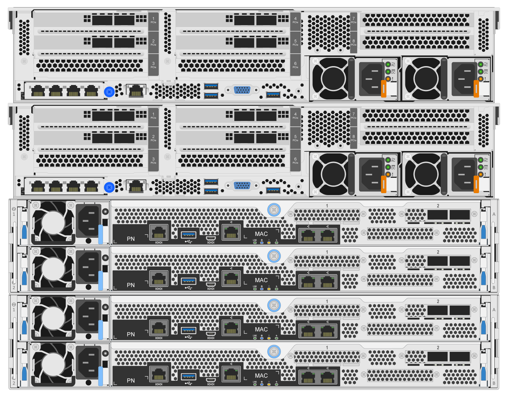

= 部署硬件
:hardbreaks:
:allow-uri-read: 
:nofooter: 
:icons: font
:linkattrs: 
:imagesdir: ./media/

[role="lead"]
每个组件都包含两个经过验证的x86文件节点、这些文件节点使用HDR (200 GB) InfiniBand缆线直接连接到两个块节点。

NOTE: 要在故障转移集群中建立仲裁、至少需要两个组件。双节点集群存在一些限制、可能会阻止成功进行故障转移。您可以通过将第三个设备整合为Tieb破碎 机来配置双节点集群；但是、本文档不会介绍这种设计。

除非另有说明、否则以下步骤对于集群中的每个组件都是相同的、无论该组件是同时用于运行BeeGFS元数据和存储服务、还是仅用于运行存储服务。

.步骤
. 使用中指定的型号为每个BeeGFS文件节点设置四个主机通道适配器(HCAS) link:beegfs-technology-requirements.html["技术要求"]。根据以下规格将HCA插入文件节点的PCIe插槽：
+
** *联想凌科系统SR6SR V3服务器：*使用PCIe插槽1、2、4和5。
** *Lenovo ThinkSystem SR6SR服务器:*使用PCIe插槽2、3、5和6。

. 为每个BeeGFS块节点配置一个双端口200 GB主机接口卡(HIC)、并在其两个存储控制器中的每个控制器中安装HIC。
+
将组件装入机架、使两个BeeGFS文件节点位于BeeGFS块节点上方。下图显示了使用Lenovo ThinkSystem SR点 来作为文件节点的BeeGFS组件的正确硬件配置(后视图)。

+

+

NOTE: 用于生产用例的电源配置通常应使用冗余PSU。

. 如果需要、请在每个BeeGFS块节点中安装驱动器。
+
.. 如果要使用此组件运行BeeGFS元数据和存储服务、而将较小的驱动器用于元数据卷、请验证这些驱动器是否已填充到最外的驱动器插槽中、如下图所示。
.. 对于所有组件配置、如果驱动器机箱未完全填充、请确保在插槽0–11和12–23中填充相同数量的驱动器、以获得最佳性能。
+
image:../media/driveslots.png[""]

. 使用连接块节点和文件节点 link:beegfs-technology-requirements.html#block-file-cables["1米InfiniBand HDR 200 GB直连铜缆"]，使它们与下图所示的拓扑相匹配。
+
image:../media/directattachcable-sr665v3.png[""]

+

NOTE: 多个组件中的节点不会直接连接。每个组件都应视为一个独立单元、并且各个组件之间的所有通信都通过网络交换机进行。

. 使用特定于InfiniBand存储交换机的将文件节点上的其余InfiniBand端口连接到存储网络的InfiniBand交换机 link:beegfs-technology-requirements.html#file-switch-cables["2米InfiniBand缆线"] 。
+
在使用分路器缆线将存储交换机连接到文件节点时、应从交换机分支出一根缆线、并连接到浅绿色所示的端口。另一根分离器电缆应从交换机分支出来、并连接到深绿色所示的端口。

+
此外、对于具有冗余交换机的存储网络、浅绿色端口应连接到一个交换机、而深绿色端口应连接到另一个交换机。

+
image:../media/networkcable.png[""]

. 根据需要、按照相同的布线准则组装其他组件。
+

NOTE: 可部署在一个机架中的组件总数取决于每个站点的可用电源和散热。

