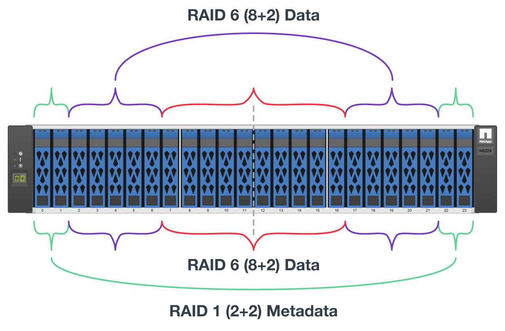
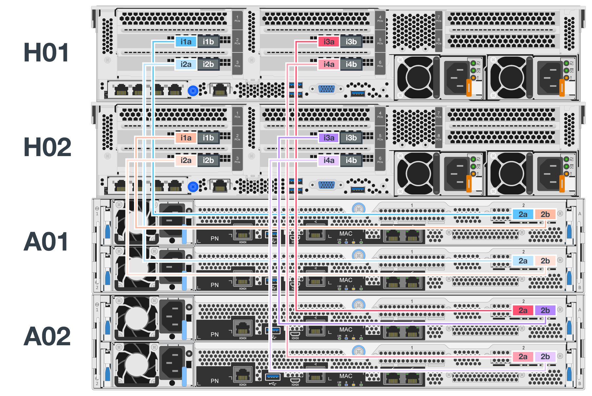
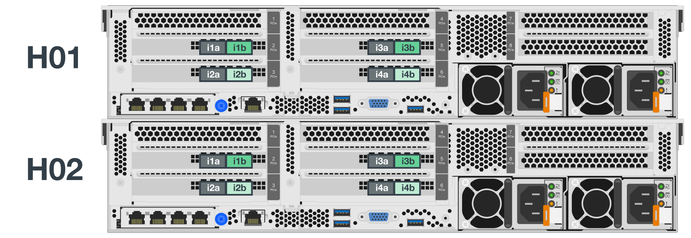

= 部署硬件
:hardbreaks:
:allow-uri-read: 
:nofooter: 
:icons: font
:linkattrs: 
:imagesdir: ./media/

[role="lead"]
每个组件都包含两个经过验证的x86文件节点、这些文件节点使用HDR (200 GB) InfiniBand缆线直接连接到两个块节点。

NOTE: 由于每个组件都包含两个BeeGFS文件节点、因此要在故障转移集群中建立仲裁、至少需要两个组件。虽然可以配置双节点集群、但此配置存在一些限制、可能会在某些情况下阻止成功进行故障转移。如果需要双节点集群、也可以将第三个设备作为Tiebreaker、但此部署操作步骤 不会涉及这一点。

除非另有说明、否则集群中的每个组件的以下步骤都是相同的、无论该组件是用于运行BeeGFS元数据和存储服务还是仅用于运行存储服务。

.步骤
. 在InfiniBand模式下为每个BeeGFS文件节点配置四个PCIe 4.0 ConnectX-6双端口主机通道适配器(Host Channel Adapter、HCA)、并将其安装在PCIe插槽2、3、5和6中。
. 为每个BeeGFS块节点配置一个双端口200 GB主机接口卡(HIC)、并在其两个存储控制器中的每个控制器中安装HIC。
+
将组件装入机架、使两个BeeGFS文件节点位于BeeGFS块节点上方。下图显示了BeeGFS组件的正确硬件配置(后视图)。

+
image:../media/buildingblock.png[""]

+

NOTE: 用于生产用例的电源配置通常应使用冗余PSU。

. 如果需要、请在每个BeeGFS块节点中安装驱动器。
+
.. 如果要使用此组件运行BeeGFS元数据和存储服务、而将较小的驱动器用于元数据卷、请验证这些驱动器是否已填充到最外的驱动器插槽中、如下图所示。
.. 对于所有组件配置、如果驱动器机箱未完全填充、请确保在插槽0–11和12–23中填充相同数量的驱动器、以获得最佳性能。
+

. 要为文件和块节点布线、请使用1米InfiniBand HDR 200 GB直连铜缆、以便与下图所示的拓扑结构匹配。
+

+

NOTE: 多个组件中的节点不会直接连接。每个组件都应视为一个独立单元、并且各个组件之间的所有通信都通过网络交换机进行。

. 使用2米(或适当长度)的InfiniBand HDR 200 GB直连铜缆将每个文件节点上的其余InfiniBand端口连接到要用于存储网络的InfiniBand交换机。
+
如果正在使用冗余InfiniBand交换机、请使用缆线将下图中以淡绿色突出显示的端口连接到不同的交换机。

+

. 根据需要、按照相同的布线准则组装其他组件。
+

NOTE: 可部署在一个机架中的组件总数取决于每个站点的可用电源和散热。

