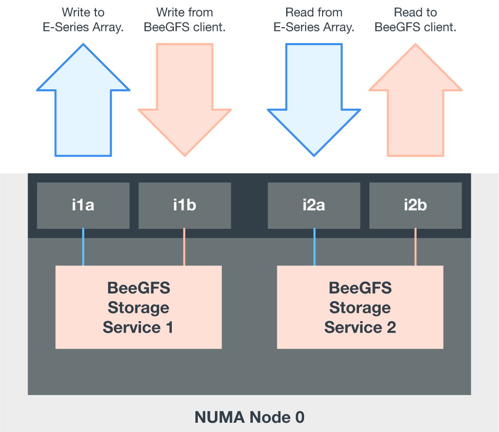

= 硬件配置
:hardbreaks:
:allow-uri-read: 
:nofooter: 
:icons: font
:linkattrs: 
:imagesdir: ./media/

[role="lead"]
NetApp上BeeGFS的硬件配置包括文件节点和网络布线。

== 文件节点配置

文件节点具有两个CPU插槽、这些插槽配置为单独的NUMA分区、其中包括对相同数量的PCIe插槽和内存的本地访问。

InfiniBand适配器必须填充到相应的PCI提升板或插槽中、以便在可用的PCIe通道和内存通道上平衡工作负载。您可以通过将单个BeeGFS服务的工作完全隔离到特定NUMA节点来平衡工作负载。目标是从每个文件节点获得类似的性能、就像两个独立的单插槽服务器一样。

下图显示了文件节点NUMA配置。

image:../media/beegfs-design-image5-small.png[""]

BeeGFS进程固定到特定的NUMA区域、以确保使用的接口位于同一区域。此配置可避免通过插槽间连接进行远程访问。插槽间连接有时称为QPI或GMI2链路；即使在现代处理器架构中、也可能会在使用诸如HDR InfiniBand等高速网络时成为瓶颈。

== 网络布线配置

在一个构建块中、每个文件节点使用总共四个冗余InfiniBand连接连接连接到两个块节点。此外、每个文件节点还具有四个到InfiniBand存储网络的冗余连接。

在下图中、请注意：

* 绿色中所示的所有文件节点端口均用于连接到存储网络结构；所有其他文件节点端口均直接连接到块节点。
* 特定NUMA区域中的两个InfiniBand端口连接到同一块节点的A和B控制器。
* NUMA节点0中的端口始终连接到第一个块节点。
* NUMA节点1中的端口连接到第二个块节点。

image:../media/beegfs-design-image6.png[""]

NOTE: 对于具有冗余交换机的存储网络、浅绿色端口应连接到一个交换机、深绿色端口应连接到另一个交换机。

图中所示的布线配置允许每个BeeGFS服务：

* 无论运行BeeGFS服务的文件节点是什么、都可以在同一NUMA区域中运行。
* 无论故障发生在何处、都要有通向前端存储网络和后端块节点的二级最佳路径。
* 如果块节点中的文件节点或控制器需要维护、则最大限度地降低性能影响。

.布线以利用带宽
要利用完整的PCIe双向带宽、请确保每个InfiniBand适配器上的一个端口连接到存储网络结构、另一个端口连接到块节点。理论上、一个HDR InfiniBand端口的最大速度为25 GBps (不考虑信号传输和其他开销)。PCIe 4.0 x16插槽的最大单向带宽为32 Gbps、如果实施的文件节点采用双端口InfiniBand适配器、理论上可处理50 GB的带宽、则可能会造成瓶颈。

下图显示了用于利用完整PCIe双向带宽的布线设计。

对于每个BeeGFS服务、请使用同一适配器将用于客户端流量的首选端口连接到作为该服务卷的主所有者的块节点控制器的路径。有关详细信息，请参见 link:beegfs-design-software-architecture.html["软件配置"]。
